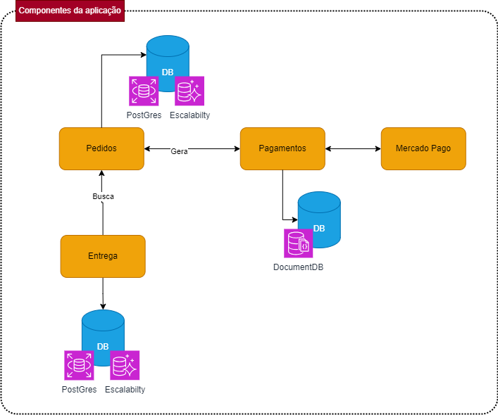

### 4º Módulo

Geral: 
https://www.loom.com/share/aba3643074444bf7b4b0147726e2eb0c?sid=a9b550d7-6806-44ae-9117-92a4fae718f2

Pedido:
https://www.loom.com/share/58d4be71ba704b299d8a3293e614dcdb?sid=98b7b6af-544c-420b-be4e-55166dc5fdf6

Entrega:
https://www.loom.com/share/ebbd39f475a04aabbde6d6b66254ea55?sid=1ba0c1a5-cb58-4663-91a5-8f0f5aa13bdd

Pagamentos:
https://www.loom.com/share/d979b1af2bd84a439b6bb17cc71848a3?sid=34982d52-c60e-49bf-bd7b-cf020bd38204

Melhorias Deploy:
https://www.loom.com/share/9d819d2af48840908072554212822180?sid=5f3b52a2-faeb-4819-a6a6-7e7d3cbf39f5


## Repositórios

https://github.com/brunoblauzius-fiap/pedido

https://github.com/brunoblauzius-fiap/pagamento

https://github.com/brunoblauzius-fiap/entrega

## Comunicação entre os microserviços
Usamos comunicação Direta, entre serviços implementado na pasta external/services/PedidoService, acessando diretamente outro serviço, sem acessar diretamente o Banco de dados.

## Coverage
### Pedido


### Pagamento


### Entrega


## AWS :: Componentes


## DATA ENGENERING :: Componentes



## Architecture

- `Architecture` : Hexagonal

  A aquitetura do segue o modelo de diretórios listado a baixo utilizado o NODE js como linguagem de programação.

```bash
    |__ app/
        |__ application/
            |__ api/
                |_ middler
                |_ routes
            |__ core/
            |__ exception/
        |__ cases
        |__ controllers/
        |__ entity/
            |__ enum
        |__ external
        |__ gateways
        |__ interfaces
        |__ types
    |__ terraform
    |__ testes
```

## ENV Variables

```bash
    MARIADB_HOST=localhost
    MARIADB_USER=root
    MARIADB_PASS=12345678
    MARIADB_DATABASE=projeto-pedidos
    MARIADB_PORT=3321
```
## Modelagem de dados


## Data Base

Banco de dados do projeto é feito com MariaDB, dentro do arquivo de conexão com o banco de dados exite um processo no qual já é criado toda a base de dados assim que for executado o build do projeto.
Cada nova tabela desenvolvida DEVE ser adicionado o create no arquivo para que seja atualizado em todas as imagens.

```bash
  path: external/mariaDBConnect.js
  example:
  await db.query(`
        CREATE TABLE IF NOT EXISTS  cliente (
            id INT PRIMARY KEY AUTO_INCREMENT,
            name VARCHAR(200) not null,
            email VARCHAR(245) not null unique,
            cpf_cnpj VARCHAR(20) not null unique,
            birthday date not null,
            created datetime null,
            modified datetime null
        )  ENGINE=INNODB;

        ...
  `);
```

## DATA BASE EXECUTABLE

Deve ser executado esse script no banco de dados, antes de iniciar a criação do pedido na API

```bash
    -- insert data values categoria
    TRUNCATE TABLE categoria;
    INSERT INTO categoria (id, name, created, modified)
            VALUES
            (1, 'Lanche',NOW(), NOW()),
            (2, 'Acompanhamento',NOW(), NOW()),
            (3, 'Bebidas',NOW(), NOW()),
            (4, 'Porções',NOW(), NOW());


    -- insert de produtos
    TRUNCATE TABLE produto;
    insert into produto (id, category_id, title, description, value, created, modified)
    values
    (1, 1, 'X-Salada', 'X-salada tradicional', 15.00, now(), now()),
    (2, 1, 'X-Salada com Bacon', 'X-salada tradicional com Bacon', 20.00, now(), now()),
    (3, 1, 'Prensado com duaa vinas', 'Prensado tradicional com duas vinas', 12.00, now(), now()),
    (4, 3, 'Fanta laranja 250ml', 'Fanata laranja lata 250ml', 5.00, now(), now()),
    (5, 3, 'Coca-Cola 250ml', 'cocacola lata 250ml', 5.00, now(), now()),
    (6, 3, 'Guaraná 250ml', 'Guaraná antartica lata 250ml', 5.00, now(), now()),
    (7, 3, 'Cerveja Bhrama 250ml', 'cerveja bramah lata 250ml', 6.00, now(), now()),
    (8, 4, 'Porção de Salada', '300gm de salada', 8.00, now(), now());


    -- criando cliente
    insert into cliente(id, name, email, cpf_cnpj, created, modified)
    values (1, 'Heitor Bernardo Victor Nogueira', 'heitoBVN@gmail.com', '31759487740', now(), now());

    -- inserindo pedido
    insert into pedidos(id, customer_id, status, total_value, created, modified)
    values (1, 1, 1, '42.00', now(), now());

    -- insert itens do pedido
    insert into pedido_produtos(id, order_id, product_id, created, modified)
    values
    (1, 1, 3, now(), now()),
    (2, 1, 2, now(), now()),
    (3, 1, 5, now(), now()),
    (4, 1, 5, now(), now())
    ;

```

## Install Application

1. Docker DEVE estar instalado na sua maquina.

2. Baixar o Projeto na sua maquina

```bash
git clone https://github.com/brunoblauzius-fiap/pedido.git
```

3. Build Project
   `Para Criar o projeto digite o codigo abaixo no console`

```bash
docker-compose up -d --build
```

## Running tests

Aplicação realiza testes unitários com ...

```bash
    npm run test
```
